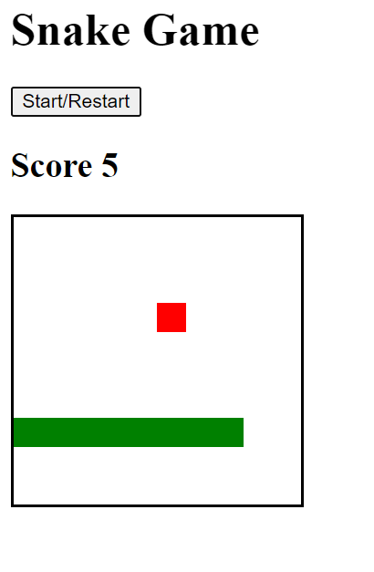

## <Snake>

## Table of Contents

  - [Description](#description)
  - [Installation](#installation)
  - [Usage](#usage)
  - [Credits](#credits)
  - [GitHub](#github)
  - [Features](#features)
  
## Description

This application replicates the traditional Nokia 3000 snake game, where a snake will move continuosly within a field and the user controls the snake movement with the keyboard arrow keys. Apples will spontaneously appear within the field and the objective of the game is to eat as many apples as possible and grow as much as possible, without touching any wall or any part of the snake. A summary of the rules is:
  
  Loosing conditions:
  - Touch any of the walls,
  - Move onto itself,
  
  Scoring conditions:
  - Eat as many apples as you can without loosing,
  - Each apple gives 1 point,
  - Each eaten apple will increase the speed by 5%, and
  - Each eaten apple will grow the snake by 1 square.

Have fun!

## Installation

No installation is needed. This application is run in a live webpage.

## Usage

To use this application, go to the deployed webpage by followig this link: [Visit the deployed page](https://aj-pena.github.io/snake/)

Once in the landing page, click on the 'Start/Restart' button to begin.

Control the snake's movement with the arrow keys to catch/eat the apple (red square). Each eaten apple will grow the snake by 1 and give you a score of 1.

The snake will continue growing, getting faster and the score will accumulate. It will take approximately 10 apples to have a significant increase in speed.

If the snake moves onto itself or touches a wall, the game will stop and your score will be cleared.

## Credits

Teacher:
- [Ania Kubow](https://github.com/kubowania)
  
Reference material:
- [w3schools](https://www.w3schools.com/)
- [StackOverflow](https://stackoverflow.com/)
- [Mozilla Developer Network](https://developer.mozilla.org/en-US/)

- [Scrimba Frontend Developer Career Path](https://scrimba.com/learn/frontend)

## GitHub

If you want to know more details, feel free to [visit the repo](https://github.com/aj-pena/snake.git)

## Features

- HTML / Handlebars
- CSS and Flexbox
- Javascript:
  -  For loop
  -  forEach()
  -  do while
  -  Conditionals
  -  EventListeners
  -  Logic operators &&, ||
  -  Arrays
  -  pop(), push(), unshift()
  -  textContent
  -  classList.add
  -  classList.remove
  -  Event.key
  -  SetInterval()
  -  ClearInterval()
  -  Math.floor()
  -  Math.random()

  
